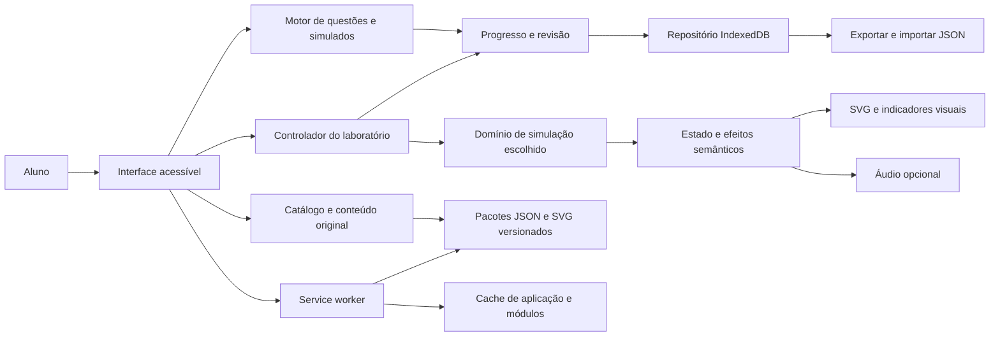

# Projeto SAEP - Documentação consolidada

Consolidado em 04/10/2026. Inclui os 15 documentos da lista de revisão, na ordem apresentada. Os textos originais foram preservados; datas e estados históricos dentro de cada documento permanecem como registrados.

## Sumário

1. [docs/PLANO-DE-EXECUCAO.md](#documento-1)
2. [docs/PROGRESSO.md](#documento-2)
3. [docs/00-conferencia-acervo-completo.md](#documento-3)
4. [docs/02-mapa-conteudo.md](#documento-4)
5. [docs/02-matriz-cobertura.md](#documento-5)
6. [docs/02-trilha-estudo.md](#documento-6)
7. [docs/02-assuntos-fora-das-provas.md](#documento-7)
8. [docs/arquitetura/README.md](#documento-8)
9. [docs/arquitetura/01-requisitos.md](#documento-9)
10. [docs/arquitetura/02-opcoes-e-decisoes.md](#documento-10)
11. [docs/arquitetura/03-componentes.md](#documento-11)
12. [docs/arquitetura/04-modelo-dados.md](#documento-12)
13. [docs/arquitetura/05-motores.md](#documento-13)
14. [docs/arquitetura/06-entrega-e-qualidade.md](#documento-14)
15. [docs/arquitetura/07-assets-e-revisao-visual.md](#documento-15)

---

<a id="documento-1"></a>

## Documento 1: docs/PLANO-DE-EXECUCAO.md

# Plano de execução - 02/10/2026

Escopo autorizado nesta sessão: Fase 0 e Fase 1. Não iniciar mapa de conteúdo, arquitetura ou aplicativo antes da aprovação.

Atualização de 02/10/2026: o usuário autorizou expressamente concluir a conferência e iniciar a Fase 2. Conferência, deduplicação, taxonomia, cobertura, trilha, metas e conteúdos complementares serão produzidos antes da próxima parada. Arquitetura e implementação continuam dependentes das aprovações seguintes.

1. Inventariar os três PDFs locais; preservar os originais e calcular SHA-256.
2. Extrair texto por página, itens, alternativas, figuras e gabaritos. Conferir os metadados e uma amostra visual; marcar limitações sem preencher lacunas por suposição.
3. Classificar manualmente tema principal e tipo principal; registrar itens mistos e duplicatas. Produzir `00-diagnostico.md` e JSON rastreável por página.
4. Pesquisar portais nacionais e regionais do SENAI por provas, simulados e Matriz de Referência. Baixar somente arquivos públicos oficiais, registrar URL, data, natureza e condições de uso; deduplicar por hash.
5. Extrair os documentos coletados, separar currículo de matriz avaliativa e publicar relatório de coleta com links e limitações.
6. Conferir contagens, alternativas, gabaritos, hashes e arquivos; atualizar `PROGRESSO.md`; apresentar resumo e pendências e aguardar aprovação.

Não há decisão de stack ou fidelidade de simulação nesta fase. Essas escolhas serão apresentadas com opções na Fase 3.

Atualização: Fase 2 concluída e continuação para Fase 3 autorizada. Proposta arquitetural salva em `docs/arquitetura/`; stack, algoritmo e fidelidade aguardam escolha explícita. Nenhuma implementação de app iniciada.

---

<a id="documento-2"></a>

## Documento 2: docs/PROGRESSO.md

# Progresso - Plataforma de estudo SAEP

Atualizado em 02/10/2026. Técnico em Eletrotécnica; Android modesto e PC, offline e acessível.

## Feito

- Atualização de 04/10/2026: requisito de assets detalhados para motores, componentes e ferramentas e de entrega por exemplos pequenos registrado em `docs/arquitetura/07-assets-e-revisao-visual.md`. Primeiro exemplo proposto: motor de seis pontas e multímetro virtual para continuidade. Mostrar e revisar antes de ampliar; comunicar assets faltantes e pesquisar programas/fontes concretos quando necessário. Esta atualização não aprova stack/algoritmo/fidelidade nem inicia implementação.

- Fases 0/1 concluídas e pesquisa ampliada para sites públicos autorizada.
- Acervo ampliado conferido: quatro PDFs e um DOCX, 241 ocorrências e 206 grupos conservadores. Dois gabaritos de 40 respostas preservados; respostas dos demais não inferidas.
- DOCX de 2023: 47 páginas conferidas no Word em modo somente leitura e 80 itens recuperados; questão 11 curta corrigida. Quatro itens têm alternativas gráficas. Mídias preservadas; repetição 3/61 consolidada na frequência, sem transferir letra de gabarito.
- Simulado 2022.2: 40 IDs distintos, dificuldades e cruzamentos impressos preservados. Sem ID compartilhado com A1/A2.
- Dois planos oficiais, quatro páginas oficiais e um manual público operacional coletados; não contados como provas.
- 76 livros SENAI, 15.161 páginas, inventariados e extraídos. Originais preservados.
- Cinco PDFs autorais para o usuário enviar ao Scribd; excluídos da frequência das provas.
- Fase 2 explicitamente autorizada e concluída: 35 subtemas, cobertura, dificuldades, prioridades, pré-requisitos, atividades, livros e conteúdos complementares.
- Metas de produção futura: 542 questões nos temas observados, 64 complementares e reserva de 16 para motores 9/12 pontas. Não são questões já produzidas.
- Entregáveis em 00-conferencia-acervo-completo.md, 02-mapa-conteudo.md, 02-matriz-cobertura.md, 02-trilha-estudo.md e 02-assuntos-fora-das-provas.md. Dados em data/fase2/ e verificação em docs/verificacao-fase2.json.

## Próximo somente após aprovação

**Atualização:** o usuário autorizou continuar para a Fase 3. A proposta foi preparada em `docs/arquitetura/README.md`, com requisitos, três opções de stack/algoritmo/fidelidade, componentes, schemas, motores, estratégia offline, testes e roadmap. As três escolhas estão pendentes nos ADRs 001-003; recomendações não foram registradas como decisões aceitas. Nenhum aplicativo criado. O próximo passo atual é receber essas escolhas, consolidar a arquitetura e apresentar o encerramento da Fase 3 para aprovação antes do MVP. A lista abaixo conserva o plano de transição da Fase 2.

1. Receber aprovação da Fase 2 para iniciar a Fase 3.
2. Confirmar unidade/estado e plano local quando disponíveis; data da prova e horas de estudo permitem ajustar calendário.
3. Elaborar requisitos e arquitetura; apresentar opções de stack, algoritmo e fidelidade com recomendação, aguardando escolha nas decisões com trade-offs.
4. Parar ao fim da Fase 3. MVP de motores apenas na Fase 4 após aprovação.

## Limitações e pendências

- Matriz integral específica não confirmada; códigos oficiais permanecem null e [VERIFICAR]. Cruzamentos antigos não equivalem à matriz vigente.
- Unidade/estado e currículo local desconhecidos. Planos CE/RR são referências comparativas.
- Ano e aplicação nacional dos documentos não certificados.
- Dificuldade impressa em S22 e editorial nos demais; desempenho do aluno ainda desconhecido.
- Deduplicação conservadora: comandos/opções diferentes ficam separados; outras variantes semânticas podem existir.
- Revisão técnica integral das respostas, transcrição e descrição acessível dos diagramas pendentes para os módulos. Anotações e setas não foram certificadas como gabarito.
- Alertas normativos do diagnóstico mantidos; questão 69 do DOCX menciona 5410/2015 para SPDA e exige conferência.
- 1.286 páginas dos livros têm pouco texto. Capítulos, versões e dados técnicos serão validados ao produzir conteúdo.
- Direitos de publicação dos materiais de terceiros não confirmados; versão compartilhada deve usar conteúdo original.

## Retomada e reprodução

Ler 02-mapa-conteudo.md e relatórios vinculados. Scripts: extrair_docx_saep.py, conferir_acervo_fase2.py e gerar_fase2.py, nessa ordem. A conferência requer tmp/pdfs/colecao-2023-conferencia.pdf, exportado do Word em modo somente leitura. extrair_simulado_2022.py reproduz a extração do PDF novo. Scripts iniciais preservam o diagnóstico histórico dos três PDFs. Não repetir downloads ou extração de todos os livros sem necessidade.

Aguardar aprovação ao fim das Fases 2, 3, 4 e de cada módulo da Fase 5. Não iniciar arquitetura ou implementação antes da aprovação correspondente.

---

<a id="documento-3"></a>

## Documento 3: docs/00-conferencia-acervo-completo.md

# Conferência do acervo antes da Fase 2

Data: 02/10/2026. Escopo: quatro PDFs e um DOCX fornecidos pelo usuário; documentos operacionais, planos de curso, livros e os cinco PDFs autorais para Scribd não são contados como provas.

| Documento | Páginas | Ocorrências de questões | Alternativas | Gabarito |
|---|---:|---:|---|---|
| avaliações.pdf | 40 | 40 | A-D | 40 respostas extraídas |
| avaliações 2.pdf | 37 | 40 | A-D | 40 respostas extraídas |
| SIMULADO 2026.pdf | 32 | 41 | A-D | Não localizado |
| Simulado Eletrotécnica 2022.2 | 14 | 40 | A-E | Não localizado |
| Questões SAEP 2023 DOCX | 47 renderizadas | 80 | A-E, incluindo alternativas em imagem | Sem gabarito formal; há anotações e setas |

Total: **241 ocorrências**. As 47 páginas do DOCX foram confirmadas por exportação local do Word em modo somente leitura. O PDF de conferência fica em `tmp/pdfs/colecao-2023-conferencia.pdf`; não é uma nova prova do acervo.

## Correção da divergência do DOCX

A questão 11 tem o enunciado curto “A figura a seguir representa a planta baixa de uma cozinha residencial”. O limite de comprimento usado na primeira extração não a reconhecia como início de questão. O ajuste e a comparação com o documento renderizado recuperaram **80 questões em sequência**, sem lacuna entre 1 e 80.

As alternativas textuais foram novamente extraídas do PDF de conferência, reconhecendo os formatos `A)`, `(A)` e `A-`. **76 itens possuem alternativas textuais A-E; quatro (13, 15, 17 e 27) possuem alternativas gráficas**, com as imagens originais vinculadas. Foram preservadas também imagens do formato VML, antes ausentes de alguns vínculos de parágrafo. Todos os 62 arquivos de mídia do DOCX estão salvos. A inspeção visual percorreu as 47 páginas em folhas de contato, com ampliação das páginas que explicam a divergência e as alternativas gráficas. Não equivale à revisão técnica integral das soluções ou à transcrição acessível de cada desenho.

Há setas indicando alternativas e uma resolução anexada à opção A da questão 11. Elas são anotações de autoria não certificada. Nenhuma foi transformada em gabarito oficial. O JSON de conferência mantém fonte e páginas; o original não foi editado.

Para os quatro itens com alternativas gráficas, também foram salvas páginas completas compostas em `data/fase2/figuras-conferencia/`, vinculadas aos itens. Isso conserva desenhos agrupados e setas que não aparecem como uma imagem simples no parágrafo do DOCX.

## Deduplicação conservadora

- A1/A2: 33 identificadores SAEP compartilhados, sem divergência das letras de gabarito nesses dois documentos.
- S26: itens 10 e 23 repetidos, conforme conferência anterior.
- C23: itens 3 e 61 repetem a situação de termografia/manutenção preditiva, com pequenas diferenças de redação e alternativas reordenadas. Consolidar a frequência do conteúdo em um grupo, preservando ambas as ocorrências; nunca transferir letra de resposta entre alternativas reordenadas.
- C23 item 31 e S26 itens 10/23 apresentam situação semelhante de medição de alimentação do motor, mas têm comandos/alternativas diferentes; foram mantidos separados.
- S22: 40 IDs distintos e nenhum compartilhado com A1/A2. Não surgiu outro candidato na comparação textual das extrações.

Resultado: **206 grupos conservadores**, calculados como 241 - 33 - 1 - 1. Similaridade serve para localizar candidatos, não para excluir automaticamente questões. Não afirmar que inexistem outras variantes semânticas. Os grupos, páginas e ocorrências ficam em `data/fase2/indice-deduplicado.json`; candidatos e decisões estão registrados nesta conferência e em `candidatos-duplicatas.json`.

## Limites preservados

O acervo é de avaliações, simulados e coleção de terceiros; aplicação nacional e anos de todas as avaliações não estão certificados. Cruzamentos impressos em S22 foram preservados literalmente, sem converter para uma matriz atual desconhecida. Continuam válidos os alertas técnicos do diagnóstico inicial. A questão 69 do DOCX menciona “5410/2015” ao tratar de SPDA: [VERIFICAR] referência do autor antes de reutilizar conteúdo normativo.

Conferência de estrutura e contagem concluída; revisão técnica integral, descrições acessíveis e confirmação de respostas pertencem ao trabalho de conteúdo dos próximos módulos.

---

<a id="documento-4"></a>

## Documento 4: docs/02-mapa-conteudo.md

# Fase 2 - Mapa de conteúdo e plano de estudo

Executada em 02/10/2026 após autorização explícita do usuário para concluir a conferência e iniciar esta fase. A arquitetura e a implementação ainda aguardam a aprovação prevista ao fim da Fase 2.

## Resultado

O acervo conferido tem **241 ocorrências em cinco documentos e 206 grupos conservadores**. Todas as ocorrências receberam um subtema principal em uma taxonomia editorial com **35 subtemas**. A classificação permite rastrear enunciado, fonte e página; não atribui códigos oficiais que não foram confirmados.

Entregáveis:

- [Conferência do acervo](00-conferencia-acervo-completo.md): correção do DOCX, alternativas gráficas e duplicatas.
- [Matriz de cobertura](02-matriz-cobertura.md): frequência por documento e grupo, dificuldade e prioridade.
- [Trilha de estudo](02-trilha-estudo.md): ordem por pré-requisitos, atividade e livros para cada subtema.
- [Conteúdos complementares](02-assuntos-fora-das-provas.md): assuntos curriculares não observados ou parcialmente cobertos.
- `data/fase2/mapa-conteudo.json`, `matriz-cobertura.csv`, `ocorrencias-classificadas.json` e `indice-deduplicado.json`: dados rastreáveis.
- `docs/verificacao-fase2.json`: conferência de contagens, livros e ausência de ciclos na trilha.

## Prioridades e método

A prioridade quantitativa usa frequência distinta × dificuldade média, com pesos 1/2/3. Nos 40 itens de S22 a dificuldade vem do rótulo impresso; nos demais é estimativa editorial de esforço, identificada nos dados. Não há resultados do aluno para medir dificuldade real. O maior peso do grupo é usado quando há ocorrências repetidas, evitando reduzir a prioridade pela repetição.

| Ordem por escore | Subtema | Escore |
|---:|---|---:|
| 1 | P01 - Condutores e fatores de correção | 36 |
| 2 | H02 - Sequências e diagnóstico eletropneumático | 26 |
| 3 | R02 - Subestações e barramentos | 25 |
| 4 | A02 - CLP e controle sequencial | 24 |
| 5 | E06 - Inversores e parametrização | 23 |
| 6 | P02 - Proteções, curvas e curto-circuito | 21 |

Segurança e fundamentos entram antes dessas prioridades porque sustentam a execução dos laboratórios. Itens contextuais podem mobilizar mais de um assunto; a matriz conta um subtema principal para não duplicar frequências. Temas de apoio aparecem nos pré-requisitos. A pontuação não é previsão estatística da próxima prova.

## Metas e cobertura curricular

Planejadas **542 questões originais** nos 35 subtemas observados, entre 8 e 24 por subtema; **64** em conteúdos curriculares complementares e uma reserva de **16** para motores de 9/12 pontas solicitados, condicionada a fonte técnica. São metas iniciais de produção nas fases futuras, não questões já disponíveis. Cada etapa de cálculo terá quatro alternativas; o mini-simulado poderá reproduzir o perfil de quatro ou cinco alternativas da fonte de estilo escolhida.

O currículo de referência vem dos planos oficiais CE e RR já coletados, com páginas de evidência no relatório complementar, e dos livros fornecidos. A unidade e o estado ainda não foram informados; a correspondência com o plano local está [VERIFICAR]. A eletrônica digital aparece como lógica no acervo, enquanto outros dispositivos merecem expansão curricular; Dahlander agora tem evidência no DOCX e não é mais uma lacuna total.

A taxonomia é Área > Tema > Subtema > item da Matriz. O último campo permanece `null` com [VERIFICAR] em todos os subtemas. Os cruzamentos de S22 ficam separados como rótulos impressos: não certificam uma matriz integral nem a edição vigente. Isso limita a afirmação de cobertura oficial, mas permite ordenar o estudo e preparar a arquitetura após aprovação.

## Próxima fase

Após aprovação, iniciar a Fase 3 e apresentar opções de stack, motor de simulação e fidelidade para escolha. O MVP de motores será tratado na Fase 4 com revisão de pré-requisitos. Ainda não foi escolhida tecnologia ou algoritmo.

## Resumo da Fase 2

1. DOCX conferido em 47 páginas e corrigido para 80 questões.
2. Acervo de cinco documentos: 241 ocorrências e 206 grupos conservadores.
3. Todas as ocorrências classificadas em 35 subtemas editoriais rastreáveis.
4. Frequências por documento, dificuldade e prioridades registradas.
5. Trilha ordenada por pré-requisitos, atividades e livros de apoio.
6. Metas: 542 questões observadas, 64 complementares e reserva de 16 para extensões.
7. Matriz oficial integral e currículo local permanecem [VERIFICAR].
8. Fase 2 concluída; Fase 3 aguarda aprovação do usuário.

---

<a id="documento-5"></a>

## Documento 5: docs/02-matriz-cobertura.md

# Fase 2 - Matriz de cobertura e prioridades

As colunas contam ocorrências por documento. A coluna distintos elimina 33 IDs compartilhados A1/A2, a repetição 10/23 de S26 e a repetição 3/61 de C23. Mesma situação com comando ou alternativas diferentes permanece separada. Frequência nesta coleção não é probabilidade de cair na prova.

| ID | Área / tema / subtema | A1 | A2 | S26 | S22 | C23 | Distintos | Dificuldade média | F × D | Meta |
|---|---|---:|---:|---:|---:|---:|---:|---:|---:|---:|
| F01 | Fundamentos / Circuitos CC/CA / Unidades e grandezas CC/CA | 2 | 2 | 1 | 0 | 1 | 5 | 1.0 | 5 | 14 |
| F02 | Fundamentos / Circuitos CC/CA / Lei de Ohm e associação de resistores | 2 | 1 | 1 | 1 | 1 | 5 | 2.2 | 11 | 14 |
| F03 | Fundamentos / Circuitos CC/CA / Frequência, formas de onda e reatância | 1 | 1 | 0 | 1 | 0 | 2 | 2.0 | 4 | 8 |
| F04 | Fundamentos / Energia e eficiência / Potência, energia e fator de potência | 0 | 0 | 1 | 2 | 2 | 5 | 1.6 | 8 | 14 |
| M01 | Medições / Instrumentos / Multímetro, alicate e seleção de escala | 4 | 4 | 4 | 2 | 5 | 14 | 1.14 | 16 | 24 |
| M02 | Medições / Instrumentos / Continuidade e resistência de isolamento | 0 | 1 | 1 | 3 | 1 | 6 | 1.0 | 6 | 16 |
| S01 | Segurança / Segurança em eletricidade / Desenergização e reenergização | 1 | 2 | 1 | 2 | 2 | 7 | 1.43 | 10 | 18 |
| S02 | Segurança / Segurança em eletricidade / Qualificação, EPI, altura e zonas de risco | 1 | 1 | 1 | 1 | 3 | 6 | 1.17 | 7 | 16 |
| S03 | Segurança / Segurança em eletricidade / Classificação de tensão e documentação | 2 | 2 | 0 | 2 | 0 | 4 | 1.5 | 6 | 12 |
| I01 | Instalações / Instalações prediais / Tomadas, iluminação e previsão de cargas | 0 | 0 | 0 | 1 | 4 | 5 | 1.4 | 7 | 14 |
| I02 | Instalações / Instalações prediais / Interruptores, sensores e relé fotocélula | 0 | 0 | 1 | 2 | 4 | 7 | 1.71 | 12 | 18 |
| I03 | Instalações / Projetos elétricos / Simbologia, unifilar, multifilar e CAD | 1 | 1 | 2 | 3 | 1 | 7 | 2.43 | 17 | 18 |
| P01 | Proteção / Dimensionamento / Condutores, instalação e fatores de correção | 3 | 4 | 4 | 0 | 3 | 12 | 3.0 | 36 | 24 |
| P02 | Proteção / Dimensionamento / Disjuntores, fusíveis, curvas e curto-circuito | 1 | 0 | 0 | 2 | 5 | 8 | 2.62 | 21 | 20 |
| P03 | Proteção / Proteção de pessoas / DR, IDR, DDR e coordenação de funções | 0 | 0 | 2 | 1 | 2 | 5 | 1.4 | 7 | 14 |
| P04 | Proteção / Aterramento e SPDA / Esquemas de aterramento e equipotencialização | 1 | 1 | 0 | 0 | 2 | 3 | 1.0 | 3 | 10 |
| P05 | Proteção / Aterramento e SPDA / Captação, descida, aterramento e DPS | 1 | 1 | 3 | 0 | 4 | 8 | 1.25 | 10 | 20 |
| E01 | Máquinas / Motores elétricos / Placa, potência, corrente e velocidade | 1 | 1 | 1 | 0 | 2 | 4 | 2.0 | 8 | 12 |
| E02 | Máquinas / Motores elétricos / Bobinas, fechamentos e ligação monofásica/trifásica | 0 | 0 | 0 | 1 | 1 | 2 | 1.5 | 3 | 8 |
| E03 | Máquinas / Comandos e partidas / Direta, reversão, selo e intertravamento | 1 | 0 | 0 | 1 | 3 | 5 | 1.8 | 9 | 14 |
| E04 | Máquinas / Comandos e partidas / Estrela-triângulo e compensadora | 2 | 2 | 0 | 0 | 2 | 4 | 3.0 | 12 | 12 |
| E05 | Máquinas / Comandos e partidas / Dahlander e duas velocidades | 0 | 0 | 0 | 0 | 1 | 1 | 3.0 | 3 | 8 |
| E06 | Máquinas / Acionamentos / Inversor, soft-starter e parametrização | 4 | 4 | 1 | 1 | 2 | 8 | 2.88 | 23 | 20 |
| T01 | Máquinas / Transformadores / Relação de transformação e proteções | 1 | 1 | 1 | 1 | 1 | 4 | 2.0 | 8 | 12 |
| T02 | Potência / Medição e proteção em SEP / TC, TP, relés e medição indireta | 0 | 0 | 0 | 2 | 2 | 4 | 2.0 | 8 | 12 |
| R01 | Potência / Redes de distribuição / Estruturas, postes, alimentadores e topologias | 5 | 5 | 2 | 0 | 2 | 9 | 2.22 | 20 | 22 |
| R02 | Potência / Subestações / Equipamentos, barramentos e operação | 0 | 0 | 1 | 6 | 2 | 9 | 2.78 | 25 | 22 |
| A01 | Automação / CLP e lógica / Booleanos, binário, tabela verdade e Ladder | 3 | 3 | 1 | 0 | 1 | 6 | 1.83 | 11 | 16 |
| A02 | Automação / CLP e lógica / Entradas, saídas e controle sequencial | 1 | 1 | 4 | 0 | 2 | 8 | 3.0 | 24 | 20 |
| A03 | Automação / Sensores / Sensores de presença, alarme e nível | 0 | 0 | 0 | 0 | 4 | 4 | 1.0 | 4 | 12 |
| H01 | Automação / Pneumática e hidráulica / Válvulas, atuadores e simbologia | 0 | 0 | 2 | 3 | 2 | 7 | 1.71 | 12 | 18 |
| H02 | Automação / Pneumática e hidráulica / Sequências, selo e diagnóstico eletropneumático | 0 | 0 | 1 | 1 | 7 | 9 | 2.89 | 26 | 22 |
| D01 | Manutenção / Manutenção e diagnóstico / Preventiva, preditiva, corretiva e inspeções | 1 | 1 | 0 | 0 | 4 | 4 | 1.0 | 4 | 12 |
| D02 | Manutenção / Manutenção e diagnóstico / Termografia, conexões e localização de falhas | 1 | 1 | 2 | 1 | 2 | 6 | 1.17 | 7 | 16 |
| V01 | Energia / Energia solar fotovoltaica / Arranjos, potência e eficiência | 0 | 0 | 3 | 0 | 0 | 3 | 2.0 | 6 | 10 |

Totais: 40 + 40 + 41 + 40 + 80 = 241 ocorrências; 206 grupos conservadores; 542 questões originais planejadas, ainda não produzidas.

A1/A2: avaliações sem ano confirmado; S26: simulado 2026; S22: simulado 2022.2; C23: coleção em DOCX, 2023 no nome. Dificuldade: pesos 1/2/3, rótulos impressos em S22 e estimativas editoriais nos demais. A prioridade soma o maior peso de cada grupo do subtema: frequência distinta × dificuldade média não arredondada. Não usa dificuldade de aluno ainda desconhecida.

Taxonomia, pré-requisitos, tipos de atividade, fontes e cruzamentos impressos estão em `data/fase2/mapa-conteudo.json`. O campo item_matriz_referencia permanece null: [VERIFICAR]. Cada ocorrência tem classificação e origem em `ocorrencias-classificadas.json`.

---

<a id="documento-6"></a>

## Documento 6: docs/02-trilha-estudo.md

# Fase 2 - Trilha de estudo e metas

Ordem obtida dos pré-requisitos; entre conteúdos liberados, prioriza segurança, fundamentos e escore de frequência × dificuldade. Não há datas fixas porque disponibilidade e data da prova não foram informadas. Estude em blocos de 25 a 40 minutos e ajuste pelo desempenho.

Cada subtema seguirá explicação curta → atividade → perguntas por etapas → revisão dos erros. Critério provisório de avanço: resolver 8 de 10 itens originais novos sem dica e explicar o raciocínio; segurança requer completar o procedimento do cenário sem pular etapas. Isso é meta pedagógica, não nota mínima oficial do SAEP.

| Ordem | Subtema | Pré-requisitos | Atividade principal | Questões originais | Livros de apoio |
|---:|---|---|---|---:|---|
| 1 | S01 - Desenergização e reenergização | nenhum | sequência normativa e cenário de decisão | 18 | livro-076 Segurança em Eletricidade |
| 2 | S02 - Qualificação, EPI, altura e zonas de risco | S01 | norma e análise de cenário | 16 | livro-075 Qualidade, Saúde, Meio Ambiente e Segurança nos Serviços em Eletricidade; livro-076 Segurança em Eletricidade |
| 3 | F01 - Unidades e grandezas CC/CA | nenhum | explicação e cálculo | 14 | livro-013 Eletricidade - Volume 1 [TÉCNICO EM ELETROTÉCNICA]; livro-015 Eletricidade - Volume 2 [TÉCNICO EM ELETROTÉCNICA] |
| 4 | M01 - Multímetro, alicate e seleção de escala | F01 | instrumento virtual e diagnóstico | 24 | livro-013 Eletricidade - Volume 1 [TÉCNICO EM ELETROTÉCNICA]; livro-015 Eletricidade - Volume 2 [TÉCNICO EM ELETROTÉCNICA] |
| 5 | F02 - Lei de Ohm e associação de resistores | F01 | cálculo passo a passo e circuito virtual | 14 | livro-013 Eletricidade - Volume 1 [TÉCNICO EM ELETROTÉCNICA] |
| 6 | F03 - Frequência, formas de onda e reatância | F01, F02 | laboratório de formas de onda e cálculo | 8 | livro-015 Eletricidade - Volume 2 [TÉCNICO EM ELETROTÉCNICA] |
| 7 | F04 - Potência, energia e fator de potência | F01, F02, F03 | cálculo e painel de cargas | 14 | livro-011 Eficiência Energética; livro-015 Eletricidade - Volume 2 [TÉCNICO EM ELETROTÉCNICA] |
| 8 | I03 - Simbologia, unifilar, multifilar e CAD | F01 | leitura de planta e desenho | 18 | livro-049 Leitura e Interpretação de Desenho [TÉCNICO EM ELETROTÉCNICA]; livro-072 Projetos Elétricos Prediais - Volume 1 |
| 9 | R01 - Estruturas, postes, alimentadores e topologias | I03, S02 | leitura de estruturas e projeto | 22 | livro-032 Fundamentos de Redes de Distribuição; livro-062 Montagem e Instalação de Redes de Distribuição [ELETRICISTA DE REDES DE DISTRIBUIÇÃO DE ENERGIA ELÉTRICA] |
| 10 | H01 - Válvulas, atuadores e simbologia | I03 | identificação de componentes | 18 | livro-001 Acionamento de Dispositivos Atuadores - Volume 1 [TÉCNICO EM AUTOMAÇÃO INDUSTRIAL]; livro-003 Acionamento de Dispositivos Atuadores - Volume 2 [TÉCNICO EM AUTOMAÇÃO INDUSTRIAL] |
| 11 | A01 - Booleanos, binário, tabela verdade e Ladder | F01 | lógica interativa | 16 | livro-021 Eletrônica Digital; livro-031 Fundamentos de Automação |
| 12 | E01 - Placa, potência, corrente e velocidade | F04, M01 | placa interativa e cálculo | 12 | livro-006 Acionamentos Eletroeletrônicos; livro-007 Comandos Elétricos |
| 13 | T01 - Relação de transformação e proteções | F03, F04 | cálculo e diagrama | 12 | livro-037 Instalações de Sistemas Elétricos de Potência (SEP); livro-015 Eletricidade - Volume 2 [TÉCNICO EM ELETROTÉCNICA] |
| 14 | T02 - TC, TP, relés e medição indireta | T01, M01, S01 | diagrama e cálculo | 12 | livro-037 Instalações de Sistemas Elétricos de Potência (SEP); livro-070 Projetos de Sistemas Elétricos de Potência |
| 15 | R02 - Equipamentos, barramentos e operação | R01, T02 | diagrama unifilar e cenário | 22 | livro-037 Instalações de Sistemas Elétricos de Potência (SEP); livro-059 Manutenções e Operações de Sistemas Elétricos de Potência (SEP); livro-070 Projetos de Sistemas Elétricos de Potência |
| 16 | I01 - Tomadas, iluminação e previsão de cargas | F04, S01 | planta interativa e cálculo | 14 | livro-044 Instalações Elétricas Prediais - Volume 1; livro-045 Instalações Elétricas Prediais - Volume 2; livro-072 Projetos Elétricos Prediais - Volume 1 |
| 17 | P01 - Condutores, instalação e fatores de correção | F04, I01, S01 | cálculo com tabela e comparação | 24 | livro-045 Instalações Elétricas Prediais - Volume 2; livro-071 Projetos Elétricos Industriais |
| 18 | P02 - Disjuntores, fusíveis, curvas e curto-circuito | P01 | cálculo e leitura de curvas | 20 | livro-042 Instalações Elétricas Industriais - Volume 1; livro-043 Instalações Elétricas Industriais - Volume 2 |
| 19 | I02 - Interruptores, sensores e relé fotocélula | I01, M01 | ligação em diagrama e diagnóstico | 18 | livro-044 Instalações Elétricas Prediais - Volume 1; livro-034 Instalação de Sensores e Dispositivos de Automação |
| 20 | P03 - DR, IDR, DDR e coordenação de funções | S01, I01 | comparação de dispositivos e circuito | 14 | livro-044 Instalações Elétricas Prediais - Volume 1; livro-076 Segurança em Eletricidade |
| 21 | M02 - Continuidade e resistência de isolamento | M01, S01 | multímetro e megômetro virtuais | 16 | livro-007 Comandos Elétricos; livro-058 Manutenção Elétrica Predial e Industrial |
| 22 | S03 - Classificação de tensão e documentação | F01, S01 | norma e leitura de prontuário | 12 | livro-076 Segurança em Eletricidade |
| 23 | V01 - Arranjos, potência e eficiência | F04, P01 | cálculo e arranjo virtual | 10 | livro-011 Eficiência Energética; livro-070 Projetos de Sistemas Elétricos de Potência |
| 24 | D01 - Preventiva, preditiva, corretiva e inspeções | S01 | classificação de cenários e planejamento | 12 | livro-055 Manutenção de Sistemas Eletroeletrônicos Industriais; livro-058 Manutenção Elétrica Predial e Industrial |
| 25 | D02 - Termografia, conexões e localização de falhas | D01, M02 | diagnóstico visual | 16 | livro-055 Manutenção de Sistemas Eletroeletrônicos Industriais; livro-058 Manutenção Elétrica Predial e Industrial |
| 26 | E02 - Bobinas, fechamentos e ligação monofásica/trifásica | E01, M02 | laboratório de terminais | 8 | livro-006 Acionamentos Eletroeletrônicos; livro-007 Comandos Elétricos |
| 27 | E03 - Direta, reversão, selo e intertravamento | E02, P02 | diagrama de força e comando | 14 | livro-007 Comandos Elétricos; livro-060 Montagem de Sistemas de Controle e Acionamento Eletromecânicos |
| 28 | H02 - Sequências, selo e diagnóstico eletropneumático | H01, E03, A01 | laboratório de sequência | 22 | livro-001 Acionamento de Dispositivos Atuadores - Volume 1 [TÉCNICO EM AUTOMAÇÃO INDUSTRIAL]; livro-003 Acionamento de Dispositivos Atuadores - Volume 2 [TÉCNICO EM AUTOMAÇÃO INDUSTRIAL] |
| 29 | A02 - Entradas, saídas e controle sequencial | A01, E03 | laboratório de CLP | 20 | livro-031 Fundamentos de Automação; livro-005 Acionamento de Dispositivos Elétricos Automatizado |
| 30 | E06 - Inversor, soft-starter e parametrização | E03, F03 | painel virtual e diagnóstico | 20 | livro-006 Acionamentos Eletroeletrônicos |
| 31 | E04 - Estrela-triângulo e compensadora | E03 | laboratório e escolha de componentes | 12 | livro-007 Comandos Elétricos; livro-006 Acionamentos Eletroeletrônicos |
| 32 | A03 - Sensores de presença, alarme e nível | A02, I02 | seleção e diagrama | 12 | livro-034 Instalação de Sensores e Dispositivos de Automação; livro-047 Integração de Sensores e Dispositivos de Automação |
| 33 | E05 - Dahlander e duas velocidades | E03 | diagrama e comparação de velocidades | 8 | livro-007 Comandos Elétricos; livro-006 Acionamentos Eletroeletrônicos |
| 34 | P04 - Esquemas de aterramento e equipotencialização | S01, I03 | diagrama interativo | 10 | livro-044 Instalações Elétricas Prediais - Volume 1; livro-076 Segurança em Eletricidade |
| 35 | P05 - Captação, descida, aterramento e DPS | P04 | identificação de subsistemas e norma | 20 | livro-045 Instalações Elétricas Prediais - Volume 2; livro-076 Segurança em Eletricidade |

## Revisão e uso das fontes

Retome os erros na próxima sessão, depois em aproximadamente 3 e 7 dias; ajuste os intervalos após observar retenção. Ainda não é decisão do algoritmo da plataforma. Cálculos terão quatro alternativas em cada etapa conforme pedido; mini-simulados devem preservar o perfil de quatro ou cinco alternativas da fonte escolhida, sem misturá-los sem informar.

Para cada meta, distribuir inicialmente cerca de metade em itens contextualizados e metade em etapas. Subtemas gráficos devem incluir diagramas próprios; normativos devem citar edição e trecho verificados. Metas não autorizam gerar ou publicar cópias de questões reais. Os cinco PDFs criados para upload no Scribd não foram contados como provas nem fontes de frequência.

Livros estão identificados no inventário; páginas de sumário e caminhos constam no JSON. A seleção é de apoio, sem prometer revisão integral ou pertinência de todas as páginas. Valores de catálogo, normas e modelos de motores de 9/12 pontas precisam de conferência específica antes da implementação.

O MVP de motores continua previsto para a Fase 4. Antes dele, inserir revisão curta de segurança, instrumentos, circuitos, placa e comandos. A trilha de estudo completa e a ordem de implementação do MVP são planos diferentes.

---

<a id="documento-7"></a>

## Documento 7: docs/02-assuntos-fora-das-provas.md

# Fase 2 - Conteúdos complementares do curso

Esta lista separa conteúdos curriculares sem questão principal identificada no acervo de conteúdos já cobrados. Ausência na coleção não significa ausência no SAEP. Os planos oficiais CE e RR são referências regionais de comparação; a unidade, o estado e a versão curricular do usuário ainda precisam ser confirmados.

| Conteúdo complementar | Evidência disponível | Relação com o mapa | Meta inicial de questões originais |
|---|---|---|---:|
| Comunicação oral e escrita técnica: relatório, ordem de serviço e apresentação | Plano CE, páginas físicas 7 e 20; unidade curricular explícita | Produzir registros claros durante os cenários de manutenção; nenhuma questão principal de redação identificada | 8 |
| Sustentabilidade dos processos industriais e descarte | Plano RR, páginas 23-24; livro-074 QSMS | Segurança aparece nas questões, mas isso não comprova cobertura de gestão ambiental ou descarte | 8 |
| Empreendedorismo, modelo de negócio, orçamento e apresentação de projeto | Plano RR, páginas 138-139 | Projetos elétricos aparecem; planejamento de negócio e marketing não foram identificados como objetivo principal dos itens | 8 |
| Qualidade da energia e harmônicas | Plano RR, página 127 | Fator de potência está coberto em F04; harmônicas merecem aprofundamento separado | 10 |
| Motor síncrono | Plano CE, página 46 | E01-E06 concentram indução e comandos; não foi identificada questão principal sobre motor síncrono | 10 |
| Eletrônica digital além de booleanos e binário: circuitos e dispositivos | Plano RR, página 59; livro-021 | A01 cobre parte do assunto. Circuitos digitais completos são complemento, sem afirmar que toda eletrônica digital está ausente | 10 |
| Eletrônica aplicada além da conversão CA/CC dos inversores | Livros-010 e 018, disponíveis no inventário; correspondência curricular local [VERIFICAR] | Retificação aparece no contexto de inversores; estudo independente de dispositivos analógicos necessita confirmação no currículo local | 10 |

Metas complementares: **64 questões**, separadas das **542** dos 35 subtemas observados. São metas de produção futura, não questões já escritas. Não interpretar a soma como um pacote mínimo obrigatório para a próxima prova.

## Extensões solicitadas para o laboratório de motores

- Dahlander aparece na questão 70 do DOCX de 2023 e entrou em E05. A informação anterior de que não havia cobertura desse motor foi superada pelo novo arquivo.
- Motores de 9 e 12 pontas não tiveram evidência direta identificada nos itens. Permanecem como extensões expressamente solicitadas, com correspondência ao currículo e esquema do fabricante [VERIFICAR]. Reservar oito questões originais para cada extensão após obter fonte técnica; essas 16 não entram nas metas anteriores.
- Identificação de bobinas por continuidade e identificação de polaridade são procedimentos diferentes. Não atribuir ao multímetro uma capacidade de determinar sozinho toda a polaridade; o procedimento completo será validado na fase de conteúdo técnico.

## Pendências que afetam a abrangência

Confirmar a matriz integral e o plano da unidade antes de afirmar cobertura de todo o curso. Consultar os capítulos e suas edições ao escrever cada módulo; páginas de sumário estão no inventário e no mapa JSON. Lacunas normativas e regras de concessionária ficam [VERIFICAR], sem adotar números extraídos de questões antigas como requisitos atuais.

---

<a id="documento-8"></a>

## Documento 8: docs/arquitetura/README.md

# Fase 3 - Proposta de arquitetura

Data: 02/10/2026. Fase autorizada pelo usuário. **Status: proposta pronta para escolha de tecnologia, algoritmo e fidelidade; não é arquitetura aprovada nem aplicativo implementado.**

Recomendo uma aplicação web estática, preparada para uso offline, sem conta ou backend obrigatório. Conteúdo original em arquivos versionados, progresso no navegador e exportação de backup. As recomendações de stack e simulação abaixo ainda dependem de escolha explícita.

## Documentos

- [Assets de alta fidelidade e revisão por exemplos](arquitetura/07-assets-e-revisao-visual.md): requisito acrescentado em 04/10/2026; começar com uma prévia pequena de motores e revisar antes de ampliar.

- [Requisitos e critérios de aceite](arquitetura/01-requisitos.md).
- [Opções e decisões pendentes](arquitetura/02-opcoes-e-decisoes.md).
- [Componentes e fluxos](arquitetura/03-componentes.md).
- [Modelo de dados](arquitetura/04-modelo-dados.md), com schemas e exemplo em `schemas/` e `exemplos/`.
- [Simulação, perguntas, áudio e revisão](arquitetura/05-motores.md).
- [Offline, testes, desempenho e roadmap](arquitetura/06-entrega-e-qualidade.md).
- [ADRs propostos](arquitetura/adrs/README.md).

## Escolhas necessárias

| Decisão | Recomendação | Alternativas |
|---|---|---|
| Stack | React + TypeScript + Vite | TypeScript com DOM nativo + Vite; Svelte + TypeScript + Vite |
| Algoritmo da simulação | Grafo de ligações com regras e estados | Apenas cenários por regras; análise elétrica fasorial e circuito equivalente |
| Fidelidade | Pedagógica intermediária | Básica qualitativa; quantitativa avançada |

São escolhas separadas: o algoritmo identifica conectividade e condições; a fidelidade define quanto dos resultados é qualitativo ou quantitativo. Recomendo o conjunto da primeira coluna porque permite ligação livre de terminais, manutenção por módulos e respostas coerentes, sem exigir parâmetros elétricos ainda não disponíveis.

As comparações são avaliações de engenharia para este projeto, não benchmarks medidos. Os orçamentos de desempenho serão verificados na Fase 4. O suporte real do Android dependerá da versão do navegador; não foi prometida compatibilidade com todo Android antigo.

## Limites do planejamento

A Matriz de Referência integral e o currículo local ainda precisam de confirmação. Conteúdo com regra técnica pendente pode aparecer marcado no estudo, mas não entrar como resposta normativa certificada. Os 206 grupos do acervo servem como evidência de cobertura/estilo; a aplicação compartilhável receberá questões e diagramas originais.

Nenhuma dependência de aplicação foi instalada e nenhum esqueleto de app foi criado. A próxima ação é registrar as escolhas, consolidar os ADRs e encerrar a Fase 3 para aprovação antes do MVP.

## Resumo da proposta

1. Requisitos e critérios de aceite definidos com rastreabilidade ao pedido.
2. Três stacks comparadas; React/TypeScript/Vite recomendado, ainda pendente.
3. Grafo com regras e fidelidade intermediária recomendados, ainda pendentes.
4. Componentes, modelo de dados, schemas e exemplo documentados.
5. Questões por etapas, áudio equivalente visual, progresso e revisão previstos.
6. Estratégia offline, testes, riscos e roadmap documentados.
7. Nenhum aplicativo implementado ou tecnologia aprovada por inferência.
8. Aguardando escolhas para consolidar e concluir a Fase 3.

---

<a id="documento-9"></a>

## Documento 9: docs/arquitetura/01-requisitos.md

# Requisitos e critérios de aceite

## Requisitos funcionais

| ID | Comportamento | Verificação prevista |
|---|---|---|
| RF01 | Catálogo dos 35 subtemas, complementos e pré-requisitos; filtros por área, dificuldade e erro | Todos os IDs do mapa ligados ao catálogo; lacunas de matriz visíveis |
| RF02 | Ciclo explicação curta → laboratório aplicável → perguntas por etapas → erros | Fluxo completo do módulo motores no MVP |
| RF03 | Cálculos paramétricos com valores e distratores calculados, quatro alternativas por etapa | Mesma semente reproduz dados; uma única resposta correta por etapa; resultado com unidade |
| RF04 | Feedback específico, nova tentativa e dica opcional | Um feedback por distrator; dica e tentativas registradas |
| RF05 | Laboratório: pares de bobinas, placa, tensão da rede e ligações de força/comando | Terminais conectáveis por toque, clique e teclado; estado rastreável |
| RF06 | Segurança precede mudanças de ligação; sequência completa validada com fonte | Ordem insegura reconhecida no cenário; procedimento não reduzido às três primeiras etapas |
| RF07 | Falhas de ligação geram efeitos coerentes: partida, rotação, corrente, calor e proteção | Casos de catálogo e regras verificadas; nenhuma consequência aleatória sem causa |
| RF08 | Modos estudo e prova | Estudo explica causas; prova adia explicação até entrega |
| RF09 | Som opcional com equivalentes visuais e legendas | Toda falha compreensível com som desligado |
| RF10 | Mini-simulado contextualizado com cronômetro e quatro ou cinco alternativas por perfil | Perfil informado antes de começar; correção e desempenho por tema |
| RF11 | Progresso por subtema, histórico de erros e fila de revisão | Reabertura offline mantém resultados; versões do conteúdo preservadas |
| RF12 | Backup/importação local do progresso | Round-trip, validação de versão e recuperação de arquivo inválido |
| RF13 | Baixar módulos e verificar disponibilidade offline | Módulo só indicado como disponível após assets e dados completos |
| RF14 | Fontes, revisão técnica e status [VERIFICAR] por conteúdo | Fonte rastreável; norma pendente não publicada como fato certificado |

## Requisitos não funcionais

Atualização de 04/10/2026: RF15 — representar motores, componentes e ferramentas usados em cada tema com assets detalhados, tecnicamente revisados e partes próprias para interação/animação; RNF10 — entregar primeiro um exemplo pequeno e executável do tema inicial, revisar com o usuário e só então ampliar em incrementos. Critérios e obtenção de assets em [07-assets-e-revisao-visual.md](arquitetura/07-assets-e-revisao-visual.md).

| ID | Critério | Limite/observação |
|---|---|---|
| RNF01 | Android e PC pelo navegador, sem instalação pesada | Adicionar à tela inicial é opcional; instalação PWA não é requisito para estudar |
| RNF02 | Offline após primeira carga e download do módulo | Primeiro acesso precisa obter os arquivos; nenhum servidor remoto durante estudo |
| RNF03 | Interface por teclado, toque e leitor de tela | Foco visível; conectores também operáveis por seleção de origem/destino |
| RNF04 | Legibilidade e feedback independente de cor/áudio | Texto, formas e rótulos; contraste e zoom verificados |
| RNF05 | Desempenho em aparelho modesto | Orçamentos propostos em 06; validar em dispositivo real, além de emulação |
| RNF06 | Conteúdo separado do código, versionado e validado | JSON Schema e verificações semânticas no build |
| RNF07 | Dados pessoais locais por padrão | Nenhuma conta, telemetria ou sincronização obrigatória no escopo proposto |
| RNF08 | Atualização sem apagar estudo ou interromper prova | Migração versionada, backup e atualização fora da sessão |
| RNF09 | Manutenção por uma pessoa | Dependências pequenas, domínio testável sem interface; README de autoria de conteúdo |

## Escopo dos motores

O MVP será uma fatia completa com partida direta e motor de seis pontas, ampliada gradualmente para monofásico, estrela/triângulo, estrela-triângulo, reversão e diagnóstico. Motores de 9/12 pontas e Dahlander permanecem no roadmap; exigem esquemas e regras próprias, sem reaproveitar fechamento de seis pontas por suposição. Identificação de polaridade será uma atividade distinta da continuidade, baseada em procedimento técnico validado.

O pedido de corrente, aquecimento e falhas coerentes será atendido conforme fidelidade escolhida. Onde faltarem parâmetros, usar indicadores qualitativos rotulados; nunca apresentar um número arbitrário como medição real. Casos quantitativos dependem de fonte e de testes.

## Critérios de encerramento do MVP

Fluxo explicação/laboratório/etapas/mini-simulado/progresso completo; fonte e testes para todas as regras liberadas; uso offline verificado; feedback sem áudio; interação por teclado; backup funcional; README para executar e adicionar conteúdo. A aprovação da Fase 3 não equivale a aprovação automática da Fase 4.

---

<a id="documento-10"></a>

## Documento 10: docs/arquitetura/02-opcoes-e-decisoes.md

# Opções de tecnologia e simulação

Status: aguardando escolha. Todos os resultados de desempenho abaixo são expectativas de projeto, não medições.

## Stack

As três alternativas produzem uma aplicação web estática. Offline, SVG/Canvas, Web Audio e armazenamento local são capacidades do navegador integradas pelo projeto, não garantias automáticas de um framework. Vite documenta build e publicação estática. [Build do Vite](https://vite.dev/guide/build), [publicação estática](https://vite.dev/guide/static-deploy.html).

| Critério | A: React + TypeScript + Vite | B: TypeScript + DOM nativo + Vite | C: Svelte + TypeScript + Vite |
|---|---|---|---|
| Android/PC sem instalação | Navegador; compatibilidade a validar | Navegador; compatibilidade a validar | Navegador; compatibilidade a validar |
| Offline | Service worker e armazenamento adicionados | Mesma estratégia | Mesma estratégia |
| Áudio e animações | APIs do navegador; estado visual em componentes | APIs diretas; gerenciamento manual do DOM | APIs do navegador; componentes compilados |
| Aparelho modesto | Carregar por módulo; simulação fora de renders frequentes | Potencial menor custo de UI; medir | Potencial menor custo de UI; medir |
| Manter sozinho | Componentes facilitam telas/formulários; aprender hooks e estado | Menos ferramentas conceituais; mais disciplina para estados e atualizações | Templates concisos; aprender reatividade própria |
| Evolução dos 35 subtemas | Reuso explícito de explicação/etapas/laboratório | Reuso possível, exige convenções próprias | Bom reuso em componentes |
| Custo principal | Runtime e disciplina de efeitos/renders | Risco de DOM e estado se divergirem em telas complexas | Dependência de sintaxe e ecossistema específico |

**Recomendação A:** componentes para perguntas, instrumentos, progresso e acessibilidade reduzem repetição conforme o catálogo cresce. O domínio não dependerá de React. B é razoável se você preferir trabalhar diretamente com HTML/DOM; C é razoável se priorizar templates concisos e aceitar aprender Svelte. Documentação primária: [React](https://react.dev/learn), [TypeScript](https://www.typescriptlang.org/docs/handbook/intro.html), [Svelte](https://svelte.dev/docs/svelte/overview).

## Algoritmo da simulação

| Opção | Como funciona | Vantagem | Limitação |
|---|---|---|---|
| A: grafo de ligações + regras + estados | Nós representam terminais; arestas representam fios/chaves fechadas; regras reconhecem bobinas, tensões, topologia e sequência | Permite ligação livre e causas explicáveis; ligações equivalentes não dependem de desenho exato | Precisa de regras técnicas verificadas por família de motor; não resolve automaticamente toda rede elétrica |
| B: cenários apenas por regras | Lista de configurações e eventos previstos; resposta por cenário | Implementação inicial menor | Ligações livres combinatórias podem gerar casos sem cobertura; não comparar apenas uma lista de fios exata |
| C: análise fasorial + equivalente por fase | Resolve valores elétricos de redes suportadas e modelo do motor | Quantificação mais ampla em regime definido | Exige parâmetros, solver, convergência e domínio de validade; circuito equivalente em regime não representa sozinho toda dinâmica de partida/falha |

**Recomendação A:** cobre terminais livres e permite evolução. Regras validam conectividade elétrica e sequência, usando estados para segurança, operação e falhas. C pode ser um calculador restrito futuro, sem substituição silenciosa do modelo.

## Fidelidade

| Opção | Saídas | Custo e validade |
|---|---|---|
| A: intermediária pedagógica | Cálculos exatos apenas em modelos suportados; corrente/calor qualitativos em falhas; rotor, proteção e legendas coerentes | Exige fontes de cada regra; permite atingir o objetivo de diagnóstico sem inventar medidas |
| B: básica qualitativa | Mensagens, estado ligado/desligado, sentido e indicação de risco | Mais rápida; deixa limitada a exploração de corrente por fase e aquecimento |
| C: avançada quantitativa | Curvas temporais e valores por fase em cenários modelados | Mais parâmetros e validação; não é uma extensão gratuita das animações |

**Recomendação A:** amostras nominais podem usar placa; falhas sem parâmetros mostrarão “elevada”, “desequilibrada” e índice didático claramente identificado. Não prometer temperatura física ou tempo real para queima. Se você escolher C, revisaremos cronograma e fontes necessárias antes do MVP.

## Propostas de áudio e revisão

Áudio: síntese com Web Audio é a proposta inicial (assets menores e resposta contínua); gravações dão timbre mais realista, mas exigem licença/arquivos e podem aumentar downloads. As duas opções mantêm equivalente visual. A síntese é sinal didático, não reprodução acústica fiel. Iniciar após ação do usuário respeita a política de reprodução do navegador. [Boas práticas Web Audio](https://developer.mozilla.org/en-US/docs/Web/API/Web_Audio_API/Best_practices).

Revisão: proposta inicial de intervalos configuráveis por regras simples e histórico de tentativas. Alternativas: algoritmo com fator de facilidade ou agendamento probabilístico com parâmetros/dados de treinamento. A regra simples é suficiente para iniciar e deve ser apresentada como heurística, sem prometer otimização científica. Esses detalhes podem ser ajustados na consolidação.

---

<a id="documento-11"></a>

## Documento 11: docs/arquitetura/03-componentes.md

# Componentes e fluxos

Diagrama lógico independente de framework; a escolha visual ainda está pendente. Aplicação proposta: arquivos estáticos + domínio local, sem backend obrigatório.



| Componente | Responsabilidade | Evitar |
|---|---|---|
| Interface | Navegação, formulários, foco, mensagens | Regras elétricas dentro de eventos de clique |
| Domínio | Estado determinístico, cálculos e validação de ligações | Consultar DOM, áudio ou rede para produzir resultado |
| Questões | Gerar valores e etapas, calcular distratores e corrigir | Executar expressão arbitrária de JSON com eval |
| Progresso | Registrar tentativa e revisão, resumir desempenho | Gravar a cada frame de animação |
| Repositório | Transações, migração, backup e erros de quota | Acoplar motor elétrico ao formato de IndexedDB |
| Renderizador | Exibir estado semântico e alternativa ao som | Criar a causa da falha apenas na animação |
| Offline | Aplicação e pacotes disponíveis, versões consistentes | Limpar dados de progresso ao atualizar assets |

## Fluxo do laboratório

Entrada do aluno → validação de ação no estado de segurança → atualização das conexões → análise do grafo/regra do cenário → evento de efeito → exibição visual/áudio → registro de marco. Um passo recebe estado anterior, ação e tempo simulado, retorna novo estado e eventos. O mesmo estado gera os mesmos eventos com a mesma semente.

Relógio do modelo separado da animação. Ao sair do laboratório, interromper loop e liberar áudio; ao ocultar página, pausar no modo estudo. No modo prova, não continuar a dinâmica elétrica escondida: persistir o último estado, mas manter o prazo da prova pelo relógio de sessão. A visibilidade da página pode ser detectada pela API correspondente. [Page Visibility](https://developer.mozilla.org/en-US/docs/Web/API/Page_Visibility_API).

## Pastas propostas para a futura implementação

```text
src/
  app/                   navegação e composição
  ui/                    componentes acessíveis
  domain/
    simulation/          regras, grafo e famílias de motor
    questions/           geradores e correção
    progress/            revisão e resumos
  infrastructure/        IndexedDB, áudio, relógio e backup
  rendering/             SVG, indicadores e animação
content/
  catalog.json
  modules/motores/        lição, cenários e templates originais
  assets/                diagramas próprios e acessíveis
schemas/                 contratos de conteúdo e persistência
tests/                   domínio, integração e E2E
public/                  manifest e assets locais
scripts/                 validar conteúdo e construir pacotes
```

Essa árvore é um plano, não foi criada como app. Extrações e provas de `data/` permanecem fora dos pacotes de publicação. Dependências/versionamento serão definidos após a escolha da stack.

---

<a id="documento-12"></a>

## Documento 12: docs/arquitetura/04-modelo-dados.md

# Modelo de dados

## Conteúdo separado do código

JSON contém catálogo, módulos, fontes, cenários e templates de questões. Texto de lição usa Markdown restrito, sem HTML executável. Código implementa geradores registrados por ID; os templates só indicam parâmetros, faixas e identificadores. Não executar funções serializadas, scripts embutidos ou fórmulas arbitrárias com eval.

Schemas propostos em `schemas/`: módulo, template de questão e backup de progresso. O exemplo em `exemplos/modulo-motores.json` é um contrato de metadados em rascunho, não conteúdo técnico liberado. [JSON Schema 2020-12](https://json-schema.org/draft/2020-12/json-schema-validation).

| Entidade | Campos centrais | Regra |
|---|---|---|
| Module | id, contentVersion, title, subthemeIds, prerequisites, sources, technicalStatus, lessons, labs, questionTemplates | Versão imutável ao salvar sessão; subtemas precisam existir no mapa |
| Source | id, title, locator, verificationStatus | Página/trecho/edição rastreável; pendência explícita |
| Lesson | id, markdownPath, sourceIds | Caminho local permitido; nenhum acesso remoto para estudar |
| Lab | id, scenarioId, family, sourceIds | Família precisa de regras/modelo registrado e revisão |
| QuestionTemplate | id, subthemeId, kind, generatorId, parameterBounds, optionCount, sourceIds | Etapas: 4 opções; simulado: perfil 4 ou 5; resposta gerada pelo domínio |
| QuestionInstance | templateId, templateVersion, generatorVersion, seed, parameters, steps, optionPermutation | Materializada ao iniciar; valores mantidos durante retomada |
| Attempt | id, instanceId, stepId, selectedOptionId, correct, hints, attemptIndex, occurredAt | Registrar erro específico e não só nota final |
| ReviewCard | subthemeId, dueAt, intervalDays, lapses, schedulerVersion | Agendamento por fonte de erro; clock/versão explícitos |
| ExamSession | id, profileId, startedAt, deadlineAt, status, instances, answers | Não recalcular parâmetros ou permutação ao reabrir |
| LabSession | scenarioVersion, modelVersion, mode, state, connections | Salvar marcos, não todos os frames |
| ProgressBackup | schemaVersion, exportedAt, moduleVersions, attempts, reviews, sessions | Migrações compatíveis e importação transacional |

## Integração com a Fase 2

Os IDs F01–V01 e demais IDs do mapa são as chaves de subtema; não IDs da matriz oficial. `matrixItemId` deve aceitar null e vir acompanhado de status “pendente” até confirmação. Cruzamentos antigos do acervo ficam em dados de pesquisa, sem convertê-los em código oficial do módulo por inferência.

## Armazenamento proposto

IndexedDB para sessões, tentativas, revisão e configurações; Cache API para aplicação/arquivos do conteúdo. LocalStorage apenas para preferência simples de tema/áudio, se necessário, sem histórico volumoso. Interface de repositório permite usar API nativa ou wrapper pequeno depois; essa biblioteca não é requisito arquitetural.

O backup distingue versão de schema, conteúdo, gerador, simulador e scheduler. Mudanças de conteúdo não reescrevem respostas antigas. Ao remover conteúdo, os resultados continuam com título/versão da sessão, sem quebrar a interface.

## Validações além do schema

IDs únicos; referências existentes; pré-requisitos sem ciclos; min <= max; quantidade de opções coerente; gerador/modelo registrados; unidade suportada; uma resposta correta; distratores distintos após arredondamento; fontes completas para conteúdo liberado; arquivo de lição/SVG existente; pacote sem provas reais. Schemas verificam estrutura, não certificam física ou norma.

---

<a id="documento-13"></a>

## Documento 13: docs/arquitetura/05-motores.md

# Motores de simulação, questões e revisão

## Simulação proposta

Interface lógica: `step(estado, ação, tempoSimulado) → novoEstado + eventos`. A implementação concreta depende da escolha do algoritmo. Rede elétrica, proteção, procedimento de segurança e animação são partes distintas. A fonte é descrita por tensão, frequência e sequência de fases; bobinas por família, terminais e parâmetros verificados.

No algoritmo recomendado, construir componentes conectados e distinguir fios, contatos, bobinas, alimentação e proteção. Avaliar curto, falta de fase, alimentação incompatível, fechamento estrela/triângulo, sequência e intertravamento antes de permitir a energização do cenário. Não considerar uma ligação correta só porque coincide com coordenadas ou com ordem de criação dos fios.

| Situação | Comportamento pedagógico a implementar | Limite técnico |
|---|---|---|
| Ligação compatível e fases presentes | Partida e rotação segundo o cenário | Corrente/carga nominais apenas com placa/modelo validado |
| Sequência de fases invertida | Sentido invertido no motor suportado | Não tratar toda inversão de bobina como mera troca de fase |
| Fase ausente | Distinguir motor parado de motor já em movimento, carga e proteção | Não impor um único resultado universal para todas as condições |
| Tensão/fechamento incompatível | Falha de partida, corrente e calor conforme regra verificada | Sem valores numéricos inventados para qualquer motor |
| Bobina invertida/erro nos terminais | Diagnóstico específico da família | Polaridade e geometria precisam de fonte própria |
| Selo/intertravamento incorreto | Contator não mantém operação ou conflito detectado | Proteção/tempo dependem do cenário |
| Sobrecarga persistente | Aquecimento didático e atuação de proteção | Índice de calor não deve ser rotulado como temperatura real |

No modo estudo, identificar causa e sugerir inspeção. No modo prova, mostrar os sinais sem revelar a resolução. O erro de procedimento deve produzir um evento de risco e bloqueio pedagógico; não usar animação de dano físico a pessoas. A consequência elétrica, quando aplicável, precisa de condição de energização definida.

Sequência de segurança completa será baseada no texto normativo verificado, incluindo etapas além de seccionar/impedir/constatar. Isso é conteúdo técnico pendente, não decisão de interface. Para motores de 9/12 pontas e Dahlander, usar modelos separados e diagramas próprios revisados.

## Motor de perguntas

1. Selecionar template e versão; criar semente reproduzível.
2. Gerar parâmetros dentro de faixas e hipóteses verificadas.
3. Calcular resposta e resultados de erros típicos registrados em código.
4. Filtrar valores inválidos e colisões de alternativas após arredondamento.
5. Ordenar opções por uma permutação salva, com IDs estáveis.
6. Ao acertar, liberar a etapa seguinte com substituição dos valores; ao errar, feedback do erro e dica opcional.
7. Ao concluir, mostrar resultado com unidade e solução completa.

Não gerar alternativas por textos aleatórios desconectados do raciocínio. Erros como esquecer fator trifásico, confundir entrada/saída ou unidade só entram onde a hipótese física e a fórmula forem válidas. Resposta precisa ser única na tolerância definida para unidade/arredondamento. Questões paramétricas não recebem valores “corretos” digitados manualmente como fonte da verdade; exemplos resolvidos são fixtures independentes de teste.

Mini-simulado: perfil explícito de 4 ou 5 opções, seleção balanceada por cobertura, sem duplicata de template com os mesmos parâmetros. Deadline salvo; retomada não reinicia o cronômetro. Ao entregar/expirar, congelar respostas e gerar resumo por subtema. Códigos da matriz só serão exibidos como oficiais após confirmação.

## Áudio e equivalência visual

Proposta: criar AudioContext apenas após ação do aluno; volume limitado e botão para silenciar; reutilizar contexto e desconectar nós ao sair. Modelar estado semântico (“zumbido”, “vibração”, “proteção atuou”) antes de som e desenho. Uma base sonora de 60 Hz com harmônicos será apenas efeito didático nos cenários dessa frequência, nunca inferida como espectro acústico real do motor. Inversor/rede em outra frequência exigem efeito coerente e identificado.

Cada evento tem rótulo textual, intensidade visual e causa no modo estudo. Rotor e indicador de temperatura acompanham estado. Respeitar redução de movimento; leitor de tela anuncia mudanças relevantes, não cada frame. Legendas continuam com som desligado. [Web Audio: boas práticas e reprodução após interação](https://developer.mozilla.org/en-US/docs/Web/API/Web_Audio_API/Best_practices).

## Progresso e revisão

Salvar conclusão, primeiro acerto, tentativas, dicas e erros por subtema. Não considerar acerto após várias dicas como domínio igual ao primeiro acerto. A fila inicial proposta combina erro recente, atraso da revisão e pré-requisito.

Heurística proposta: erro retorna na próxima sessão; acerto sem dica progride em intervalos configuráveis de 1, 3, 7 e 14 dias; novo erro reduz o intervalo. A versão do scheduler e a data-alvo são salvas. Não é promessa de algoritmo científico otimizado. Comparação com fator de facilidade ou algoritmo probabilístico pode ser feita antes de alterar o agendamento.

---

<a id="documento-14"></a>

## Documento 14: docs/arquitetura/06-entrega-e-qualidade.md

# Offline, qualidade, riscos e roadmap

## Funcionamento offline

Aplicação e módulo inicial em cache; demais módulos baixados sob demanda. Manifesto de pacote declara versão, arquivos, tamanho e hashes. Baixar para cache temporário, validar o pacote inteiro, então promover a versão ativa. Falha ou falta de espaço conserva a versão anterior. Não remover o pacote usado por sessão em andamento.

O primeiro acesso precisa carregar os arquivos pela rede ou servidor local apropriado. Service workers exigem HTTPS, com exceção de desenvolvimento em localhost; abrir index.html por file:// não oferece a mesma estratégia. [Uso de service workers](https://developer.mozilla.org/en-US/docs/Web/API/Service_Worker_API/Using_Service_Workers).

Cache de interface/conteúdo e IndexedDB de progresso têm ciclos diferentes. Atualização de assets não apaga tentativas. Antes de migrar dados, produzir backup local e transação com rollback. Notificar atualização disponível e aplicá-la fora do laboratório/prova; não ativar nova versão no meio de uma sessão.

Dados do navegador podem ser removidos por quota, política de armazenamento ou limpeza do usuário. Solicitar persistência quando disponível, mostrar uso/espaço estimado e disponibilizar exportação manual; sem prometer armazenamento permanente. [Quotas e remoção de dados](https://developer.mozilla.org/en-US/docs/Web/API/Storage_API/Storage_quotas_and_eviction_criteria).

## Desempenho e acessibilidade

Orçamentos propostos, a medir na Fase 4: JavaScript inicial comprimido até 250 KB; pacote inicial de motores até 5 MB sem livros/provas; resposta comum ao toque até 100 ms na maioria das interações do aparelho-alvo; renderização adaptável entre 20 e 30 fps durante laboratório. Essas metas podem ser revistas com medições, sem transformar médias em garantia absoluta.

Carregar uma lição/laboratório por vez. Usar SVG para diagramas e terminais; Canvas apenas se uma animação justificar. Não atualizar toda a interface a cada frame; estado do domínio em passos controlados, renderização via requestAnimationFrame, áudio por eventos. Pausar renderização invisível. Worker só se perfil de desempenho revelar cálculo que bloqueia a UI.

Verificar teclado, leitor de tela, zoom a 200%, redução de movimento, alvos de toque, contraste, legendas e modos com som desligado. Arrastar fios sempre terá alternativa “selecionar terminal de origem → destino”. Informação de cor terá texto/símbolo. O dispositivo Android e navegador-alvo ainda não foram informados.

## Estratégia de testes

| Camada | Casos relevantes | Evidência de aceite |
|---|---|---|
| Conteúdo | Schema, IDs, referências, fontes, ciclos e arquivos | Build rejeita pacote incoerente |
| Cálculos | Exemplos resolvidos independentes, unidades, arredondamento, limites de parâmetros | Resultado esperado e uma única opção correta |
| Simulação | Fase ausente, tensão incompatível, fechamentos, sequência, intertravamento, segurança | Causa e efeito corretos com casos técnicos conhecidos |
| Propriedades | Ordem dos fios/nome dos nós não muda conectividade; sem progressão de calor desenergizado no modelo aplicável | Testes reproduzíveis por semente |
| Progresso | Atualização, exportação/importação, quota e migração | Dados anteriores recuperáveis; erro explícito |
| E2E | Fluxo completo, reload offline, prazo de prova, modos e teclado | Passa no build de produção em contexto seguro |
| Dispositivo real | Toque, legibilidade, áudio, memória e bateria | Registro do aparelho/navegador; emulação não basta |

Ferramentas propostas para a stack web: testes unitários com Vitest e E2E com Playwright; escolher versões compatíveis ao iniciar o app. Playwright oferece emulação de dispositivos e rede, mas não reproduz hardware modesto. [Vitest](https://vitest.dev/guide/), [Playwright: emulação](https://playwright.dev/docs/emulation).

Não usar o mesmo gerador como único oráculo de seus próprios testes. Fixtures técnicas precisam de resultado verificado e fonte. Testes não substituem revisão de normas, parâmetros ou direitos de publicação.

## Roadmap

Atualização de 04/10/2026: dividir a Fase 4 em incrementos com prévia e revisão do usuário. O primeiro exemplo proposto é motor trifásico de seis pontas e multímetro virtual para continuidade, com assets detalhados. Validar essa experiência antes de implementar os demais laboratórios e o restante da fatia. Ver [assets e revisão visual](arquitetura/07-assets-e-revisao-visual.md).

| Marco | Entrega | Porta de aprovação |
|---|---|---|
| F3a, esta proposta | Requisitos, opções, componentes, contratos e roadmap | Escolher stack, algoritmo e fidelidade |
| F3b | ADRs consolidados e compatibilidade revisada | Aprovar encerramento da Fase 3 |
| F4a | Revisão técnica das regras e questões do módulo motores | Conteúdo para a fatia validado |
| F4b | Aplicação, offline, laboratório e perguntas por etapas | Testes e fluxo completos |
| F4c | Mini-simulado, progresso, backup, README e verificação Android | Aprovar MVP antes de ampliar |
| F5 | Demais módulos por prioridade e pré-requisitos | Aprovar cada módulo |
| F6 | Revisão técnica final, desempenho, acessibilidade e documentação | Aceite dos critérios originais |

Sem prazo fechado: fontes pendentes, fidelidade e disponibilidade do usuário afetam esforço. O módulo motores continua primeiro na implementação; os pré-requisitos necessários entram como revisão curta na fatia vertical.

## Riscos e tratamento

| Risco | Tratamento |
|---|---|
| Matriz integral desconhecida | Manter código oficial null; rastrear cobertura editorial; atualizar após fonte confirmada |
| Regra incorreta derivada de questão antiga | Fonte primária, revisão e fixture técnica antes de liberar |
| Modelo de falha exageradamente universal | Delimitar família, carga, estado de partida e proteção; qualitativo quando necessário |
| Perda de armazenamento do navegador | Backup exportável, persistência quando disponível e migração segura |
| Primeiro acesso sem rede | Informar necessidade de obter pacote; confirmar “pronto offline” antes do uso |
| Dispositivo/browser antigo | Identificar aparelho e testar suporte; adaptar build e efeitos após medição |
| Reprodução de terceiros em versão compartilhada | Pacotes autorais; excluir data/provas, data/livros e extrações do build |
| Conteúdo malicioso importado | Validar JSON/tamanho/caminhos; Markdown restrito; sem eval nem HTML não confiável |
| Falta de parâmetros para modelo avançado | Não prometer medições quantitativas; escolha de fidelidade explícita |

## Referências consultadas

Documentação oficial dos projetos e MDN consultadas em 02/10/2026. Links estão junto às afirmações. As comparações de manutenção e recomendações são inferências de engenharia para os requisitos deste projeto.

---

<a id="documento-15"></a>

## Documento 15: docs/arquitetura/07-assets-e-revisao-visual.md

# Assets detalhados e construção por exemplos

Atualização de 04/10/2026 solicitada pelo usuário. Imagens de alta fidelidade visual são requisito do projeto. Essa exigência não escolhe a fidelidade física da simulação nem a stack pendentes.

## Aparência e animação

Motores, componentes e ferramentas devem ser reconhecíveis, detalhados e proporcionais, com terminais, seletores, bornes e inscrições legíveis nas vistas necessárias. Uma foto bonita não basta: a representação deve permitir identificar e operar o componente no laboratório.

Usar imagem detalhada para carcaça/corpo e camadas independentes para fios, pontes, terminais, ponteiros, seletor, contatos e movimento. Fotografias ou renders podem compor o corpo; SVG pode fornecer conexões e áreas de interação. O asset não define a regra elétrica. Placa, quantidade de terminais e posição das conexões precisam de revisão técnica.

Vistas iniciais propostas: motor externo e caixa de bornes aberta; multímetro frontal com visor e seletor; pontas de prova e cabos. Quando o tema exigir, acrescentar contator, disjuntor-motor e relé térmico. Cada ferramenta/componente efetivamente usado em um tema terá seu inventário de assets; não baixar toda uma biblioteca antes de saber quais vistas são necessárias.

## Obtenção e registro

Ordem de trabalho: conferir o acervo existente; procurar imagens/modelos com permissão de uso adequada; produzir desenhos/renders originais ou fotografias próprias; usar geração de imagem quando apropriado e revisar a precisão técnica. Imagens geradas não certificam terminais, símbolos ou placas. Não tratar imagens dos livros como automaticamente liberadas para publicação.

Para cada asset registrar ID, componente/modelo, vista, origem, autor, licença/permissão, uso local ou compartilhável, arquivo mestre, versão otimizada, dimensões, camadas móveis, pontos de conexão e status da revisão técnica. Conservar o mestre detalhado e servir versões menores conforme tela/zoom; baixar imagens por tema. Medir o impacto no orçamento de 5 MB proposto, revendo-o se necessário com o usuário, sem sacrificar legibilidade dos bornes.

Se faltar um asset, informar especificamente o componente, vista, camadas/formato e impedimento. Antes de sugerir instalação, pesquisar opções atuais e apresentar links, exportação suportada, licença e utilidade. O usuário pode fornecer fotos, modelos ou arquivos que tenha autorização para reutilizar.

Aplicativos/APKs não são a fonte padrão: extrair um arquivo de um pacote não concede permissão para reutilizá-lo, e uma textura isolada pode não conter as vistas ou partes necessárias. Avaliar um programa concreto pela licença dos assets e capacidade de exportação antes de pedir que o usuário baixe ou de extrair seus recursos. Preferir arquivos disponibilizados para uso/exportação e conteúdo próprio.

## Primeiro exemplo e pontos de revisão

Após consolidar e aprovar a Fase 3, iniciar somente um exemplo do tema Motores elétricos: **identificação das bobinas de um motor trifásico de seis pontas com multímetro virtual**, precedido do estado seguro do cenário. O exemplo proposto contém uma explicação curta, motor/caixa de bornes, instrumento e uma interação de continuidade. Não incluir todos os fechamentos, partidas e temas nessa primeira entrega.

Mostrar o exemplo executável para o usuário revisar aparência, escala, legibilidade, interação e feedback. Registrar as alterações pedidas e aplicar antes de ampliar. Se o asset final não estiver disponível, informar a pendência e identificar qualquer representação provisória na prévia; não apresentá-la como a versão de alta fidelidade concluída.

Após aprovação do exemplo, avançar em incrementos: placa e rede; fechamento e comando; falhas e proteção; questões por etapas; mini-simulado e progresso. Cada incremento terá prévia e ponto de revisão antes do seguinte. A fatia completa exigida na Fase 4 continua sendo o objetivo final, construída por essas entregas pequenas.

Nenhum aplicativo, asset definitivo ou exemplo executável foi criado nesta atualização documental. Stack, algoritmo e fidelidade física continuam aguardando escolha explícita.
