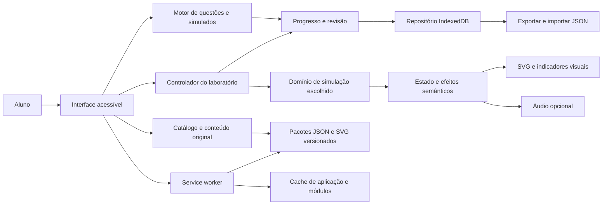

# Componentes e fluxos

Diagrama lógico independente de framework; a escolha visual ainda está pendente. Aplicação proposta: arquivos estáticos + domínio local, sem backend obrigatório.



| Componente | Responsabilidade | Evitar |
|---|---|---|
| Interface | Navegação, formulários, foco, mensagens | Regras elétricas dentro de eventos de clique |
| Domínio | Estado determinístico, cálculos e validação de ligações | Consultar DOM, áudio ou rede para produzir resultado |
| Questões | Gerar valores e etapas, calcular distratores e corrigir | Executar expressão arbitrária de JSON com eval |
| Progresso | Registrar tentativa e revisão, resumir desempenho | Gravar a cada frame de animação |
| Repositório | Transações, migração, backup e erros de quota | Acoplar motor elétrico ao formato de IndexedDB |
| Renderizador | Exibir estado semântico e alternativa ao som | Criar a causa da falha apenas na animação |
| Offline | Aplicação e pacotes disponíveis, versões consistentes | Limpar dados de progresso ao atualizar assets |

## Fluxo do laboratório

Entrada do aluno → validação de ação no estado de segurança → atualização das conexões → análise do grafo/regra do cenário → evento de efeito → exibição visual/áudio → registro de marco. Um passo recebe estado anterior, ação e tempo simulado, retorna novo estado e eventos. O mesmo estado gera os mesmos eventos com a mesma semente.

Relógio do modelo separado da animação. Ao sair do laboratório, interromper loop e liberar áudio; ao ocultar página, pausar no modo estudo. No modo prova, não continuar a dinâmica elétrica escondida: persistir o último estado, mas manter o prazo da prova pelo relógio de sessão. A visibilidade da página pode ser detectada pela API correspondente. [Page Visibility](https://developer.mozilla.org/en-US/docs/Web/API/Page_Visibility_API).

## Pastas propostas para a futura implementação

```text
src/
  app/                   navegação e composição
  ui/                    componentes acessíveis
  domain/
    simulation/          regras, grafo e famílias de motor
    questions/           geradores e correção
    progress/            revisão e resumos
  infrastructure/        IndexedDB, áudio, relógio e backup
  rendering/             SVG, indicadores e animação
content/
  catalog.json
  modules/motores/        lição, cenários e templates originais
  assets/                diagramas próprios e acessíveis
schemas/                 contratos de conteúdo e persistência
tests/                   domínio, integração e E2E
public/                  manifest e assets locais
scripts/                 validar conteúdo e construir pacotes
```

Essa árvore é um plano, não foi criada como app. Extrações e provas de `data/` permanecem fora dos pacotes de publicação. Dependências/versionamento serão definidos após a escolha da stack.
